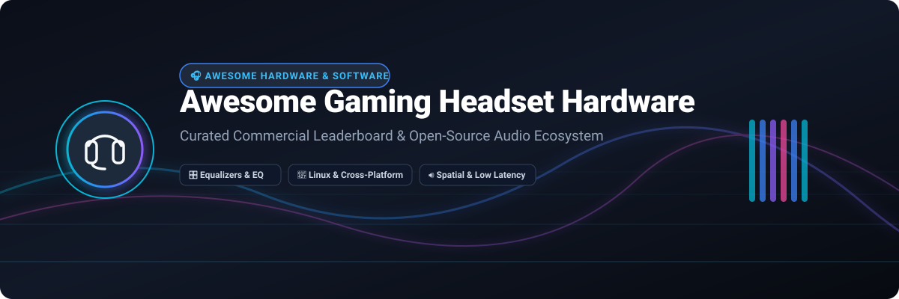

# 🎧 Awesome Gaming Headset Hardware

> **Curated Leaderboard of Commercial Headsets, SaaS Audio Control Suites & Open-Source GitHub Projects**  
> *Focused on Audio Fidelity, Latency Optimization, Long-Session Comfort, Equalization & Open Firmware*

---

## 📌 Executive Summary

This repository tracks top-tier **commercial gaming headsets**, **SaaS companion software**, and **open-source GitHub audio tools**. Whether you are looking for ultra-low latency wireless headsets for esports, studio-grade audiophile headsets, PipeWire/PulseAudio Linux equalizers, or open-source firmware replacements, this guide provides verified pricing, free tier limits, company sizes, and GitHub community metrics.

---

## 📖 Table of Contents

- [🎧 Banner & Overview](#-awesome-gaming-headset-hardware)
- [📌 Executive Summary](#-executive-summary)
- [💼 Commercial & SaaS Headset Ecosystem](#-commercial--saas-headset-ecosystem)
- [🔓 Open-Source Audio Software & Firmware](#-open-source-audio-software--firmware)
- [💡 Key Selection Guidelines](#-key-selection-guidelines)
- [🤝 How to Contribute](#-how-to-contribute)
- [⚠️ Disclaimer & Risk Notice](#️-disclaimer--risk-notice)

---

## 💼 Commercial & SaaS Headset Ecosystem

> **📊 Market Context & Industry Dynamics**: The global gaming headset market is valued at **~$4.0B in 2026** and is projected to reach **~$8.0B by 2032** (CAGR ~7.2%). The sector is **moderately fragmented** — led by established brands such as **Microsoft**, **HP (HyperX)**, **Logitech (Astro)**, **Demant (EPOS)**, **Razer**, **Corsair**, **SteelSeries**, and **Turtle Beach**. No single vendor holds a winner-take-all monopoly; consumers select devices based on audio driver tech, multi-platform connectivity, and control software capabilities.

The table below lists leading commercial gaming headsets alongside their companion software suites, ranked in descending order by **Company Size (Revenue / Valuation)**:

| 🎧 Headset & SaaS Software | 🏢 Company Size (Revenue / Valuation) | 💵 Pricing (Specific Starting Tier) | 🎁 Free Tier / Free Trial Limits | ✨ Key Features & Compatibility |
| :--- | :--- | :--- | :--- | :--- |
| **[Xbox Wireless Headset](https://www.xbox.com/en-US/accessories/headsets/xbox-wireless-headset)** *(Microsoft Accessories)* | **~$281B revenue** *(Microsoft FY2025)* | **$109.99** *(2024/2026 refreshed model)* | **Free Xbox Accessories App** *(unlimited base EQ & mic monitoring); 6-month free trial of Dolby Atmos for Headphones included with select retail bundles* | Direct Xbox Wireless pairing, Bluetooth 5.3 dual-connect, rotating earcup dials for volume/chat mix, auto-mute boom mic. |
| **[HyperX Cloud II](https://www.hyperx.com/)** *(HP Inc. Gaming)* | **~$53B revenue** *(HP Inc. FY2024/2025)* | **$65.00** *(Wired base tier)* / **$99.99** *(Wireless)* | **Free HyperX NGENUITY software** *(unlimited 7.1 surround sound toggle, EQ adjustment, and firmware management)* | 53mm dynamic drivers, hardware USB sound card, signature memory foam ear cushions, noise-cancelling detachable mic. |
| **[Logitech G PRO X & Astro A50](https://www.logitechg.com/)** *(Logitech International)* | **~$4.3B revenue** *(Logitech FY2025)* | **$114.99** *(G PRO X Wired)* / **$299.99** *(Astro A50 Gen 5)* | **Free Logitech G HUB software** *(unlimited Blue VO!CE mic filters, parametric EQ presets, and G-Key macros)* | PRO-G graphene 50mm drivers, PLAYSYNC multi-system switching base station, LIGHTSPEED 2.4GHz wireless, DTS Headphone:X 2.0. |
| **[EPOS H6PRO](https://www.eposaudio.com/)** *(Demant Group)* | **~$3.2B revenue** *(Demant Group FY2024/2025)* | **$111.46** *(H6PRO Open/Closed)* | **Free EPOS Gaming Suite software** *(unlimited 7.1 surround toggle, custom EQ creation, and mic sidetone tuning)* | Acoustic open/closed back choices, magnetic lift-to-mute boom arm, BrainAdapt acoustic engineering, 3.5mm multi-platform cables. |
| **[Razer BlackShark V2](https://www.razer.com/)** *(Razer Inc.)* | **~$1.5B revenue** *(Razer FY2025 est.)* | **$79.99** *(Wired V2)* / **$99.99** *(HyperSpeed Wireless)* | **Free Razer Synapse 3** *(unlimited basic EQ & lighting); THX Spatial Audio includes a **15-day free trial** with full spatial sound stage* | TriForce Titanium 50mm drivers, HyperClear Supercardioid mic, passive noise isolation, ultra-lightweight 240g frame. |
| **[Corsair Virtuoso RGB XT](https://www.corsair.com/)** *(Corsair Gaming)* | **~$1.46B revenue** *(Corsair FY2025 est.)* | **$269.99** *(Virtuoso RGB Wireless XT)* | **Free Corsair iCUE software** *(unlimited 10-band graphic EQ, Dolby Atmos activation on PC, and RGB lighting syncing)* | High-fidelity 50mm neodymium drivers (20Hz–40kHz), broadcast-grade 9.5mm mic, simultaneous Slipstream 2.4GHz + Bluetooth wireless. |
| **[SteelSeries Arctis Nova Pro](https://steelseries.com/)** *(SteelSeries / GN Audio)* | **~$500M revenue** *(SteelSeries / GN Group est.)* | **$199.99** *(Wired)* / **$349.99** *(Wireless)* | **Free SteelSeries GG & Sonar Audio Suite** *(unlimited parametric EQ, AI-powered noise suppression, and ChatMix across all PC headsets)* | GameDAC Gen 2, 360° Spatial Audio, Active Noise Cancellation (ANC), swappable dual-battery hot-swap system. |
| **[Turtle Beach Stealth 700](https://www.turtlebeach.com/)** *(Turtle Beach Corp)* | **~$200M revenue** *(Turtle Beach Corp)* | **$199.99** *(Stealth 700 Gen 3)* | **Free Turtle Beach Swarm II App** *(unlimited Superhuman Hearing presets, 10-band EQ, and Bluetooth button remapping)* | Cross-frame CrossPlay wireless system, 60mm Eclipse dual drivers, 80-hour battery life, flip-to-mute mic. |
| **[Beyerdynamic MMX 300](https://www.beyerdynamic.com/)** *(Beyerdynamic GmbH)* | **~$100M revenue** *(Beyerdynamic GmbH est.)* | **$249.00** *(MMX 300 2nd Gen)* | **Free analog hardware operation** *(no proprietary bloatware; compatible with free AutoEq & Equalizer APO open tools)* | Studio condenser capsule microphone, handcrafted German driver architecture, replacement pads, audiophile clarity. |

---

## 🔓 Open-Source Audio Software & Firmware

Open-source solutions empower Linux gamers, audiophiles, and privacy-conscious users to control USB headsets, customize spatial equalizers, and even flash custom firmware.

The table below is sorted in descending order by **GitHub Star Count**:

| 📦 Repository & Description | 🌟 Community Stars | ⚙️ Primary License & OS | ⚡ Core Features & Highlights |
| :--- | :---: | :---: | :--- |
| **[wwmm/easyeffects](https://github.com/wwmm/easyeffects)** *(Advanced PipeWire Audio Processing)* |  | GPL-3.0 *(Linux PipeWire)* | Parametric EQ, limiter, compressor, reverberation, auto-gain, auto-import AutoEq profiles for PipeWire systems. |
| **[jaakkopasanen/AutoEq](https://github.com/jaakkopasanen/AutoEq)** *(Automated Headphone Equalization)* |  | MIT *(Cross-platform)* | Harman-target equalization curves for **10,000+ headphone models** with Parametric EQ, Convolution IR, and Graphic EQ formats. |
| **[wwmm/pulseeffects](https://github.com/wwmm/pulseeffects)** *(PulseAudio Effects Suite)* |  | GPL-3.0 *(Linux PulseAudio)* | Legacy GTK3 audio processing suite for PulseAudio setups with equalizer, limiter, stereo enhancer, and noise gate. |
| **[werman/noise-suppression-for-voice](https://github.com/werman/noise-suppression-for-voice)** *(RNNoise Real-time Noise Suppression)* |  | GPL-3.0 *(Linux / Windows / macOS)* | Real-time microphone background noise suppression plugin based on Recurrent Neural Networks (RNN / RNNoise). |
| **[JamesDSP-Linux/JamesDSP](https://github.com/JamesDSP-Linux/JamesDSP)** *(Audio Effect Digital Signal Processor)* |  | GPL-3.0 *(Linux PulseAudio/PipeWire)* | Open-source audio DSP engine with FIR equalizer, dynamic bass boost, vacuum tube modeling, and AutoEq integration. |
| **[Sapd/HeadsetControl](https://github.com/Sapd/HeadsetControl)** *(Cross-Platform USB Headset Controller)* |  | GPL-2.0 *(Linux, macOS, Windows)* | C++20 standard library for monitoring battery status, controlling sidetone, managing RGB LEDs, and configuring hardware EQ on SteelSeries, Logitech, Corsair, and HyperX headsets. |
| **[stuarthayhurst/corsair-void-driver](https://github.com/stuarthayhurst/corsair-void-driver)** *(Linux Kernel HID Driver for Corsair)* |  | GPL-2.0-or-later *(Linux Kernel 6.13+)* | Native Linux kernel driver providing `power_supply` battery node reporting, sidetone controls, and physical mic orientation callbacks. |
| **[elegos/Linux-Arctis-Manager](https://github.com/elegos/Linux-Arctis-Manager)** *(Linux SteelSeries GG Replacement)* |  | GPL-3.0 *(Linux)* | SteelSeries Arctis ChatMix balancer, 10/15-band PulseAudio LADSPA equalizer, microphone noise suppression, and media routing. |
| **[pine64/OpenPineBuds](https://github.com/pine64/OpenPineBuds)** *(Open-Source Wireless Earbud Firmware)* |  | Apache-2.0 *(PineBuds Pro Hardware)* | Fully open wireless earbud firmware powered by Apache MyNEWT & MCUBoot; grants full register access, DSP filter tuning, and low-level control. |
| **[bhack/mini-eq](https://github.com/bhack/mini-eq)** *(Compact PipeWire Parametric Equalizer)* |  | GPL-3.0 *(Linux GTK4/Libadwaita)* | Minimalist system-wide parametric equalizer with built-in search and auto-import for AutoEq profiles on PipeWire desktops. |
| **[tdryer/eh-fifty](https://github.com/tdryer/eh-fifty)** *(Astro A50 Python CLI Controller)* |  | MIT *(Python 3 / PyUSB)* | Command-line tool for reading Astro A50 (Gen 4) base station firmware, flashing updates, and configuring EQ presets on Linux. |
| **[Odizinne/HeadsetControl-Qt](https://github.com/Odizinne/HeadsetControl-Qt)** *(Qt6 Graphical Interface for HeadsetControl)* |  | GPL-3.0 *(Windows / Linux)* | Modern Qt6 GUI wrapper around `HeadsetControl` for visualizing battery percentage, adjusting sidetone sliders, and switching LED lighting modes. |

---

## 💡 Key Selection Guidelines

When evaluating gaming headset hardware and software, consider the following key factors:

1. **Audio Driver & Equalization Flexibility**:
   - Look for planar magnetic or graphene drivers (e.g., A50 Gen 5) for ultra-fast transient response.
   - Pair your headset with [AutoEq](https://github.com/jaakkopasanen/AutoEq) profiles via [EasyEffects](https://github.com/wwmm/easyeffects) or Equalizer APO to achieve the scientifically proven Harman target curve.

2. **Cross-Platform & Open-Source Compatibility**:
   - If running Linux or SteamOS (Steam Deck), verify if the headset is supported by [HeadsetControl](https://github.com/Sapd/HeadsetControl) or has dedicated Linux kernel drivers like [corsair-void-driver](https://github.com/stuarthayhurst/corsair-void-driver).

3. **Latency & Wireless Protocols**:
   - For competitive FPS gaming, prioritize dedicated 2.4GHz ultra-low latency dongles (LIGHTSPEED, HyperSpeed, Slipstream) over standard Bluetooth.

---

## 🤝 How to Contribute

1. Fork this repository.
2. Add new commercial headsets or open-source GitHub projects to `README.md`.
3. Follow the established markdown table structure (ensure specific pricing, free tier limits, company revenue/valuation, and star badges are included).
4. Submit a Pull Request with a short summary of the additions.

---

## ⚠️ Disclaimer & Risk Notice

- This repository is a community-curated collection for educational and informational purposes.
- Commercial trademarks and product names belong to their respective owners.
- Flashing third-party firmware (such as OpenPineBuds) or using kernel drivers is performed at your own risk.

---

**Made with ❤️ for competitive gamers, audiophiles, Linux enthusiasts, and hardware modders.**
